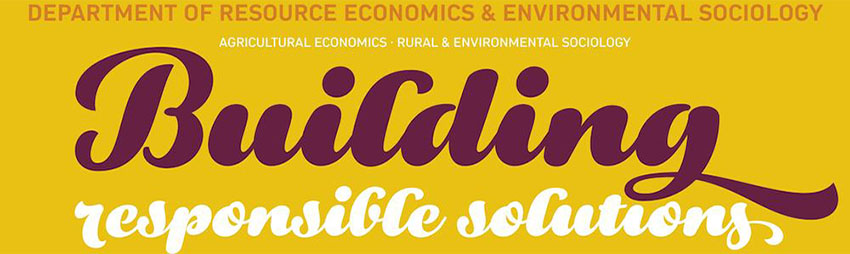

```{r setup, include=FALSE}
knitr::opts_chunk$set(echo = FALSE)
```


```{r, include=FALSE}
# Load package called pacman
if (!require(pacman)) {
	install.packages("pacman")
	library(pacman)
}

### Load packages (will install if not loaded)
p_load(rmarkdown,tinytex, tidyverse, car)
# tinytex::install_tinytex()
```


### Outline
\label{agenda}

__Disclaimer/Announcement__ \

- Mention what needs to be announced beforehand \
    - e.g. all views/opinions presented are personal \

__Contents__

1. Executive Summary \hyperlink{1}{\beamergotobutton{ESummary}}\

2. Motivation \hyperlink{2}{\beamergotobutton{Motivation}} \

3. Method \hyperlink{3}{\beamergotobutton{Method}} \

4. Result \hyperlink{4}{\beamergotobutton{Result}} \

5. Conclusion \hyperlink{5}{\beamergotobutton{Conclusion}} \

6. Reference \hyperlink{6}{\beamergotobutton{Reference}} \


\

\begin{center}
\emph{Note} you can also jump to by clicking top bar 
\end{center}

# Executive Summary

- This is an easy-to-implement template REES students can use to present. 

- This is an introduction to Rmarkdown.

# Motivation (Put title of this section here)

- e.g. REES can be more famous ! 
 
- This is a list/item
  - This is a sub item 
  
1. This is a numbered list
2. You can also show one by one called _increment_

::: incremental

3. See ?

4. This is increment

5. Note page number does not change?!

:::

---

You can also __bolden__ or _italize_ and such

See [this page for more](https://bookdown.org/yihui/rmarkdown/beamer-presentation.html)

# Method

### You can also draw

\begin{center}
    \begin{tikzpicture}
        % draw horizontal line   
        \draw (-5,0) -- (6,0);
        % draw vertical lines
    \foreach \x in {-5,-4,-3,-2, -1,0,1,2,3,6}
    \draw (\x cm,2pt) -- (\x cm,-2pt);
     % draw nodes
    \draw (-5,0) node[below=3pt] {$ 21.12 $} node[above=3pt] {$\begin{turn}{45} Task A \end{turn}$};
    \draw (-4,0) node[below=3pt] {$ 22.1 $} node[above=3pt] {$\tiny \begin{turn}{75} Task B1, Task B2, Task B3 etc.. \end{turn}$};
    \draw (-3,0) node[below=3pt] {$ 2 $} node[above=3pt] {$\begin{turn}{45} Task C \end{turn}$};
    \draw (-2,0) node[below=3pt] {$ 3 $} node[above=3pt] {$\begin{turn}{45} Task D \end{turn}$};
    \draw (-1,0) node[below=3pt] {$ 4 $} node[above=3pt] {$\begin{turn}{45} Task E \end{turn}$};
    \draw (0,0) node[below=3pt] {$ 5 $} node[above=3pt] {$\begin{turn}{45} \end{turn}$};
    \draw (1,0) node[below=3pt] {$ 6 $} node[above=3pt] {$\begin{turn}{45} \end{turn}$};
    \draw (2,0) node[below=3pt] {$ 7 $} node[above=3pt] {$\tiny \begin{turn}{75} \end{turn}$};
    \draw (3,0) node[below=3pt] {$ 8 $} node[above=3pt] {$\begin{turn}{45} \end{turn}$};
    \draw (6,0) node[below=3pt] {$ 11 $} node[above=3pt] {$\begin{turn}{45} Goal \end{turn}$};
\end{tikzpicture}
\end{center} 


### or make a table

\par

\begin{center}
\begin{tabular}{ c| c c}
\hline
    Method/Data & Same & Different \\ 
\hline
    Same & Reproducibility & Replicability\\ 
    Different & Robustness  & Generalizability\\ 
\hline
\end{tabular}
\end{center}


### or put an image 

```{r, fig.cap= 'caption goes here', fig.align = 'center',out.height="75%", out.width = '75%'}

```
  
### or an equation 

\begin{block}{For example... Hansen (2.48)} 
$\begin{aligned} \beta &=\left(\mathbb{E}\left[X X^{\prime}\right]\right)^{-1} \mathbb{E}[X Y] \end{aligned}$
\end{block}

###

\begin{columns}
\column{0.5\textwidth}
- You can also do columns \par
- This section goes right \par
- See? 

\column{0.5\textwidth}
\begin{center} - This section goes left \par
\end{center}
```{r, fig.cap= 'REES', fig.align = 'center', out.height="50%", out.width = '75%'}

```

 \end{columns}


# Summary 

::: incremental

1. REES

2. is 

3. best !
:::

# Reference

- \href{https://www.ssc.wisc.edu/~bhansen/econometrics/Econometrics.pdf}{\underline{Hansen's Econometrics}}

- \href{https://www.moqixu.com/faq/faq-how-to-have-a-better-meeting-with-your-phd-supervisor}{\underline{Moqi's Blog}}

